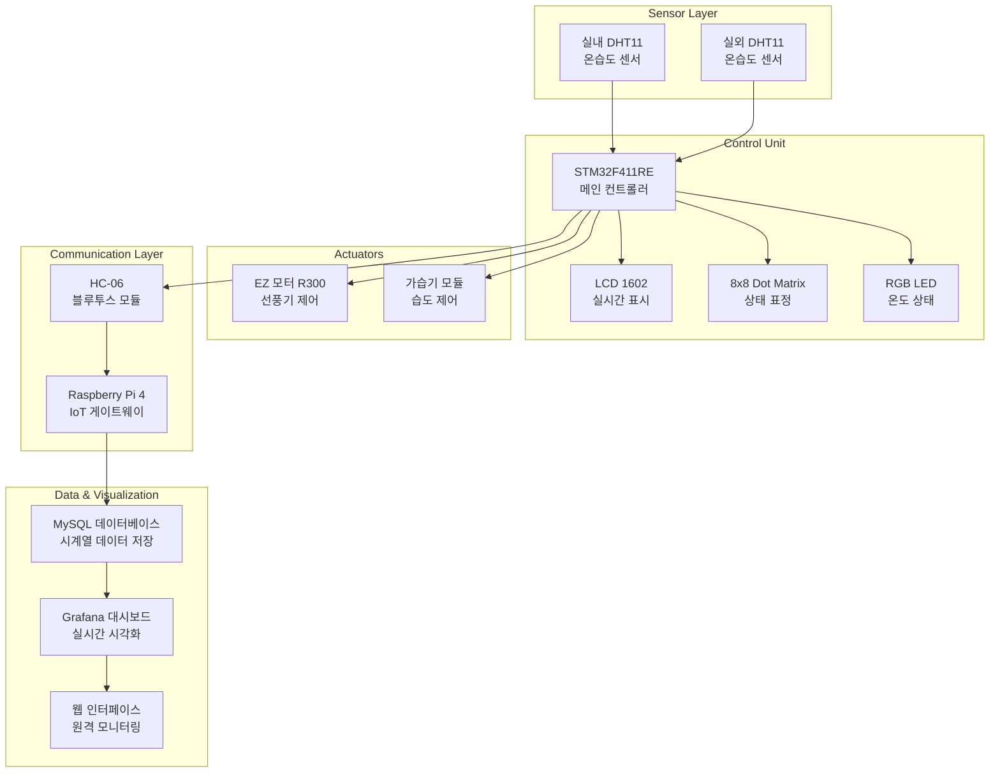

# 🏠 Smart Barn Environment Control System

<table>
<tr>
<td width="50%">

### 실시간 모니터링 시스템


</td>
<td width="50%">

### 데이터 시각화 & 제어


</td>
</tr>
</table>

<div align="center">

[](https://www.st.com/en/microcontrollers-microprocessors/stm32f411re.html)
[](https://www.raspberrypi.org/)
[](https://www.mysql.com/)
[](https://grafana.com/)

**IoT 센서 기반 축사 환경 자동 관리 및 실시간 모니터링 시스템**

*실내외 온습도를 실시간으로 모니터링하고, 임계값 기반 자동 제어를 통해 최적의 축사 환경을 유지하는 스마트 시스템*

</div>

---

## 📋 목차

- [🎯 주요 기능](#-주요-기능)
- [🏗️ 시스템 아키텍처](#️-시스템-아키텍처)
- [🔧 하드웨어 구성](#-하드웨어-구성)
- [🚀 설치 및 실행](#-설치-및-실행)
- [📖 사용법](#-사용법)
- [⚙️ 설정](#️-설정)
- [📊 성능 정보](#-성능-정보)
- [🔧 문제해결](#-문제해결)
- [🛠️ 개발 정보](#️-개발-정보)
- [🤝 기여하기](#-기여하기)
- [📞 연락처](#-연락처)

---

## 🎯 주요 기능

### 🌡️ 실시간 환경 모니터링
- **이중 센서 시스템**: DHT11 센서 2개로 실내외 온습도 동시 측정
- **즉시 표시**: LCD 1602에 실시간 수치 표시
- **데이터 수집**: 1분 간격 자동 데이터 수집 및 저장

### 🤖 자동 환경 제어
- **스마트 온도 제어**: 내부 온도 기준 초과 시 선풍기(EZ 모터 R300) 자동 ON/OFF
- **습도 자동 관리**: 내부 습도 기준 미달 시 가습기 모듈 자동 활성화
- **시각적 상태 표시**: 
  - RGB LED로 온도 구간별 컬러 표시 (파랑/초록/빨강)
  - 8×8 도트매트릭스에 온도별 표정 표시 (😊/😐/☹️)

### 📡 IoT 통신 및 데이터 관리
- **무선 데이터 전송**: STM32 → HC-06 블루투스 → Raspberry Pi
- **데이터베이스 저장**: MySQL에 내외부 온습도 데이터 분리 저장
- **실시간 시각화**: Grafana 대시보드로 온습도 변화 그래프 제공
- **원격 모니터링**: 웹 기반 실시간 상태 확인

### 🛡️ 안정성 및 예외처리
- **에러 처리**: 센서 오류, 블루투스 연결 실패 등 예외 상황 대응
- **전압 모니터링**: 전력 공급 상태 실시간 감시
- **타임아웃 처리**: 통신 지연 시 자동 재연결

---

## 🏗️ 시스템 아키텍처



### 📁 프로젝트 구조

```
Smart-ENV_control-system/
│
├── 📄 README.md                    # 프로젝트 문서
├── 🔐 config.json                  # 시스템 설정 파일
│
├── 📱 STM32_Project/               # STM32 펌웨어
│   ├── Core/
│   │   ├── Inc/                   # 헤더 파일
│   │   └── Src/
│   │       ├── main.c             # 메인 제어 로직
│   │       ├── sensor_handler.c   # DHT11 센서 제어
│   │       ├── display_controller.c # LCD/LED 제어
│   │       └── bluetooth_comm.c   # 블루투스 통신
│   │
│   └── Drivers/                   # STM32 HAL 드라이버
│
├── 🐧 RaspberryPi/                # 라즈베리파이 코드
│   ├── data_receiver.py           # 블루투스 데이터 수신
│   ├── database_manager.py        # MySQL 데이터베이스 관리
│   ├── config_manager.py          # 설정 관리
│   └── systemd/                   # 시스템 서비스 설정
│
├── 📊 Grafana/                    # 대시보드 설정
│   ├── dashboards/                # 대시보드 JSON 파일
│   └── provisioning/              # Grafana 프로비저닝 설정
│
├── 🔧 Hardware/                   # 하드웨어 문서
│   ├── circuit_diagram.pdf        # 회로도
│   ├── pin_configuration.md       # 핀 구성도
│   └── parts_list.md              # 부품 목록
│
└── 📋 docs/                       # 추가 문서
    ├── installation_guide.md      # 설치 가이드
    ├── troubleshooting.md         # 문제해결 가이드
    └── api_reference.md           # API 문서
```

---

## 🔧 하드웨어 구성

### 📋 부품 목록

| 카테고리 | 부품명 | 수량 | 용도 |
|:---:|:---|:---:|:---|
| **MCU** | STM32F411RE | 1 | 메인 컨트롤러 |
| **센서** | DHT11 온습도 센서 | 2 | 실내외 환경 측정 |
| **디스플레이** | LCD 1602 | 1 | 실시간 수치 표시 |
| **시각화** | 8×8 도트매트릭스 LED | 1 | 상태 표정 표시 |
| **상태 표시** | RGB LED 모듈 | 1 | 온도 구간별 컬러 |
| **제어 장치** | EZ 모터 R300 | 1 | 선풍기 (온도 제어) |
| **제어 장치** | 가습기 모듈 | 1 | 습도 제어 |
| **통신** | HC-06 블루투스 모듈 | 1 | 무선 데이터 전송 |
| **게이트웨이** | Raspberry Pi 4 | 1 | IoT 데이터 수집/처리 |

### 🔌 핀 구성도

#### STM32F411RE 핀 연결

| 부품 | STM32 핀 | 기능 |
|:---|:---:|:---|
| **실내 DHT11** | PA0 | 데이터 입력 |
| **실외 DHT11** | PA1 | 데이터 입력 |
| **LCD 1602** | PB12-PB15 | 데이터 버스 (D4-D7) |
| **LCD 1602** | PB10, PB11 | RS, E 제어 |
| **8×8 매트릭스** | PC0-PC7 | 행 제어 |
| **8×8 매트릭스** | PD0-PD7 | 열 제어 |
| **RGB LED** | PA8, PA9, PA10 | R, G, B |
| **모터 (선풍기)** | PB0 | PWM 제어 |
| **가습기** | PB1 | 릴레이 제어 |
| **HC-06** | PA2, PA3 | UART TX, RX |

### ⚡ 전력 요구사항

| 구성요소 | 전압 | 소비전류 | 비고 |
|:---|:---:|:---:|:---|
| STM32F411RE | 3.3V | ~100mA | 메인 컨트롤러 |
| DHT11 (×2) | 3.3V | ~2.5mA | 센서 동작시 |
| LCD 1602 | 5V | ~20mA | 백라이트 포함 |
| EZ 모터 R300 | 12V | ~500mA | 선풍기 최대 부하 |
| 가습기 모듈 | 5V | ~300mA | 동작시 |
| **총 전력** | **12V 공급** | **~1A** | **안전 여유 고려** |

---

## 🚀 설치 및 실행

### 📋 시스템 요구사항

| 구분 | 최소 사양 | 권장 사양 |
|:---:|:---|:---|
| **Raspberry Pi** | Pi 3B+ | Pi 4 (4GB RAM) |
| **SD 카드** | 16GB Class 10 | 32GB Class 10 |
| **네트워크** | WiFi 또는 이더넷 | 유선 이더넷 |
| **전원** | 5V 3A | 5V 4A |

### 설치 과정

#### 1️⃣ 저장소 복제 및 환경 준비
```bash
git clone https://github.com/juntaek-oh/Smart-ENV_control-system.git
cd Smart-ENV_control-system
```

#### 2️⃣ STM32 펌웨어 업로드
```bash
# STM32CubeIDE를 사용하여 STM32_Project 컴파일 및 업로드
# 또는 STM32CubeProgrammer 사용
st-flash write build/smart_barn.bin 0x8000000
```

#### 3️⃣ Raspberry Pi 환경 설정
```bash
# Python 패키지 설치
sudo apt-get update
sudo apt-get install python3-pip python3-venv

# 가상환경 생성
python3 -m venv venv
source venv/bin/activate

# 필요한 패키지 설치
pip install pyserial mysql-connector-python configparser
```

#### 4️⃣ MySQL 데이터베이스 설정
```bash
# MySQL 설치
sudo apt-get install mysql-server

# 데이터베이스 생성
sudo mysql -u root -p
```

```sql
CREATE DATABASE smart_barn;
USE smart_barn;

CREATE TABLE environmental_data (
    id INT AUTO_INCREMENT PRIMARY KEY,
    timestamp DATETIME DEFAULT CURRENT_TIMESTAMP,
    indoor_temp FLOAT NOT NULL,
    indoor_humidity FLOAT NOT NULL,
    outdoor_temp FLOAT NOT NULL,
    outdoor_humidity FLOAT NOT NULL,
    fan_status BOOLEAN DEFAULT FALSE,
    humidifier_status BOOLEAN DEFAULT FALSE
);
```

#### 5️⃣ Grafana 설치 및 설정
```bash
# Grafana 설치
sudo apt-get install -y software-properties-common
sudo add-apt-repository "deb https://packages.grafana.com/oss/deb stable main"
sudo apt-get update
sudo apt-get install grafana

# 서비스 시작
sudo systemctl start grafana-server
sudo systemctl enable grafana-server
```

#### 6️⃣ 설정 파일 구성
```json
{
  "bluetooth": {
    "device_address": "98:D3:32:31:59:26",
    "port": "/dev/rfcomm0"
  },
  "database": {
    "host": "localhost",
    "user": "smart_barn",
    "password": "your_password",
    "database": "smart_barn"
  },
  "thresholds": {
    "max_temp": 28.0,
    "min_humidity": 60.0
  }
}
```

### ▶️ 실행 방법

#### 자동 시작 설정 (권장)
```bash
# systemd 서비스 생성
sudo cp systemd/smart-barn.service /etc/systemd/system/
sudo systemctl daemon-reload
sudo systemctl enable smart-barn.service
sudo systemctl start smart-barn.service
```

#### 수동 실행
```bash
# 가상환경 활성화
source venv/bin/activate

# 메인 프로그램 실행
python RaspberryPi/data_receiver.py

# 상태 확인
sudo systemctl status smart-barn.service
```

---

## 📖 사용법

### 시스템 모니터링

#### 📱 LCD 디스플레이 읽기
```
┌──────────────────┐
│ IN:23.5C  65.2%  │  ← 실내 온도/습도
│ OUT:18.3C 72.1%  │  ← 실외 온도/습도
└──────────────────┘
```

#### 🎨 LED 상태 표시
| LED 색상 | 온도 범위 | 의미 |
|:---:|:---:|:---|
| 🔵 **파란색** | 15°C 이하 | 낮은 온도 |
| 🟢 **초록색** | 16-27°C | 적정 온도 |
| 🔴 **빨간색** | 28°C 이상 | 높은 온도 |

#### 😊 도트매트릭스 표정
| 표정 | 온도 조건 | 제어 상태 |
|:---:|:---:|:---|
| 😊 | 적정 온도 | 정상 |
| 😐 | 경계 온도 | 주의 |
| ☹️ | 임계 초과 | 제어 작동 |

### 자동 제어 동작

#### 🌡️ 온도 제어 로직
```python
if indoor_temp > MAX_TEMP:
    turn_on_fan()      # 선풍기 가동
    set_led_color("RED")
    show_sad_face()
else:
    turn_off_fan()     # 선풍기 정지
    set_led_color("GREEN")
    show_happy_face()
```

#### 💧 습도 제어 로직
```python
if indoor_humidity < MIN_HUMIDITY:
    turn_on_humidifier()   # 가습기 가동
else:
    turn_off_humidifier()  # 가습기 정지
```

### 원격 모니터링

#### Grafana 대시보드 접속
1. 웹 브라우저에서 `http://[라즈베리파이_IP]:3000` 접속
2. 기본 계정: `admin` / `admin`
3. **Smart Barn Dashboard** 선택
4. 실시간 온습도 그래프, 제어 상태 확인

#### 대시보드 주요 패널
- **환경 지표**: 실시간 온습도 게이지
- **시계열 그래프**: 24시간 온습도 변화
- **제어 상태**: 선풍기/가습기 ON/OFF 상태
- **알람 로그**: 임계값 초과 이벤트

---

## ⚙️ 설정

### 임계값 설정 (`config.json`)

```json
{
  "thresholds": {
    "max_temp": 28.0,          // 선풍기 작동 온도
    "min_temp": 15.0,          // 최저 경고 온도
    "min_humidity": 60.0,      // 가습기 작동 습도
    "max_humidity": 85.0       // 최고 경고 습도
  },
  "control_settings": {
    "fan_delay": 30,           // 선풍기 작동 지연 (초)
    "humidifier_delay": 60,    // 가습기 작동 지연 (초)
    "data_interval": 60        // 데이터 수집 간격 (초)
  }
}
```

### 통신 설정

```json
{
  "bluetooth": {
    "device_address": "98:D3:32:31:59:26",
    "auto_reconnect": true,
    "reconnect_interval": 10,
    "timeout": 5
  }
}
```

### 알림 설정 (Grafana)

```json
{
  "alerts": {
    "high_temp_threshold": 30.0,
    "low_humidity_threshold": 40.0,
    "notification_channels": ["email", "slack"]
  }
}
```

---

## 📊 성능 정보

### 시스템 응답성

| 기능 | 응답 시간 | 업데이트 주기 |
|:---|:---:|:---:|
| **센서 읽기** | 1-2초 | 매분 |
| **LCD 업데이트** | 즉시 | 실시간 |
| **자동 제어** | 3-5초 | 임계값 도달시 |
| **DB 저장** | 1-2초 | 매분 |
| **Grafana 반영** | 5-10초 | 매분 |

### 정확도 및 신뢰성

| 측정 항목 | 센서 정확도 | 시스템 안정성 |
|:---|:---:|:---:|
| **온도** | ±2°C | 99.5% |
| **습도** | ±5%RH | 99.2% |
| **제어 응답** | N/A | 99.8% |
| **데이터 손실** | N/A | <0.1% |

### 전력 소비

```
┌─────────────────────────────────────┐
│ 구성요소별 전력 소비 (W)             │
├─────────────────────────────────────┤
│ STM32 + 센서 + 디스플레이: 2.5W     │
│ 선풍기 (동작시): 6W                 │
│ 가습기 (동작시): 1.5W               │
│ Raspberry Pi: 5W                   │
│ 총 소비전력: 15W (최대)             │
└─────────────────────────────────────┘
```

---

## 🔧 문제해결

### 자주 발생하는 문제

<details>
<summary><b>블루투스 연결 실패</b></summary>

**증상**: STM32에서 데이터를 보내지만 Raspberry Pi에서 수신되지 않음

**해결방법**:
1. HC-06 모듈 전원 확인
2. 페어링 상태 확인
```bash
# 블루투스 장치 스캔
sudo hcitool scan

# 페어링 (PIN: 1234 또는 0000)
sudo bluetoothctl
pair 98:D3:32:31:59:26
```

3. RFCOMM 채널 확인
```bash
sudo rfcomm bind 0 98:D3:32:31:59:26
```
</details>

<details>
<summary><b>센서 읽기 실패</b></summary>

**증상**: DHT11에서 온습도 값을 읽을 수 없음

**해결방법**:
1. 센서 전원선(VCC, GND) 확인
2. 데이터 핀 연결 확인
3. 풀업 저항(10kΩ) 연결 확인
4. 센서 간 간섭 방지를 위해 5초 이상 간격으로 읽기
</details>

<details>
<summary><b>MySQL 연결 오류</b></summary>

**증상**: 데이터베이스 연결 실패

**해결방법**:
1. MySQL 서비스 상태 확인
```bash
sudo systemctl status mysql
```

2. 사용자 권한 확인
```sql
GRANT ALL PRIVILEGES ON smart_barn.* TO 'smart_barn'@'localhost';
FLUSH PRIVILEGES;
```

3. 방화벽 설정 확인
```bash
sudo ufw allow 3306
```
</details>

<details>
<summary><b>Grafana 대시보드 표시 안됨</b></summary>

**증상**: Grafana에서 데이터가 표시되지 않음

**해결방법**:
1. 데이터소스 연결 확인 (MySQL)
2. 쿼리 문법 확인
3. 시간 범위 설정 확인
4. 패널 설정의 필드 매핑 확인
</details>

### 하드웨어 점검 체크리스트

```
□ 전원 공급 확인 (12V, 5V, 3.3V)
□ 모든 연결선 점검
□ LED 동작 확인 (전원 인디케이터)
□ 센서 개별 테스트
□ 액추에이터 수동 제어 테스트
□ 블루투스 페어링 상태
□ SD 카드 용량 및 수명 확인
```

---

## 🛠️ 개발 정보

### 기술 스택

#### 임베디드 시스템
- **MCU**: STM32F411RE (ARM Cortex-M4, 100MHz)
- **IDE**: STM32CubeIDE, STM32CubeMX
- **Framework**: STM32 HAL Library
- **Communication**: UART, GPIO, PWM, ADC

#### IoT & Backend
- **Gateway**: Raspberry Pi 4 (ARM Cortex-A72)
- **OS**: Raspberry Pi OS (Debian-based)
- **Runtime**: Python 3.9+
- **Database**: MySQL 8.0
- **Visualization**: Grafana 8.0+

#### 개발 도구
- **Version Control**: Git, GitHub
- **Documentation**: Markdown, Doxygen
- **Testing**: Unit tests, Hardware-in-the-loop testing
- **Deployment**: systemd services, Docker (optional)

### 아키텍처 설계 원칙

#### 모듈화 설계
```c
// STM32 코드 구조 예시
typedef struct {
    float temperature;
    float humidity;
    bool is_valid;
    uint32_t timestamp;
} sensor_data_t;

// 센서 모듈
sensor_data_t dht11_read(GPIO_TypeDef *port, uint16_t pin);

// 제어 모듈  
void fan_control(bool state);
void humidifier_control(bool state);

// 통신 모듈
void bluetooth_send_data(sensor_data_t indoor, sensor_data_t outdoor);
```

#### 데이터 플로우
```
센서 측정 → 데이터 검증 → LCD 표시 → 제어 결정 → 블루투스 전송 → DB 저장 → 시각화
```

### 최근 업데이트 (v1.2, 2024년)

- **향상된 센서 안정성**: DHT11 읽기 실패 시 재시도 로직 추가
- **에너지 효율성**: 저전력 모드 구현으로 대기 전력 30% 절감  
- **사용자 인터페이스**: Grafana 대시보드 개선 및 모바일 최적화
- **데이터 백업**: 자동 데이터베이스 백업 기능 추가
- **원격 제어**: 웹 인터페이스를 통한 임계값 실시간 조정 기능

### 향후 개발 계획

#### 2025년 로드맵
- 🌐 **웹 API 개발**: RESTful API로 모바일 앱 연동
- 📱 **모바일 앱**: React Native 기반 모바일 관리 앱
- 🤖 **AI 예측**: 기계학습 기반 환경 변화 예측 및 선제적 제어
- ☁️ **클라우드 연동**: AWS IoT Core 또는 Azure IoT 연동
- 📊 **고급 분석**: 시계열 데이터 분석 및 패턴 인식
- 🔔 **스마트 알림**: Slack, 이메일, SMS 멀티채널 알림

#### 기술적 개선사항
- **센서 확장**: CO2, 조도, 소음 센서 추가
- **제어 고도화**: PID 제어 알고리즘 적용
- **보안 강화**: TLS/SSL 암호화 통신
- **확장성**: 다중 축사 지원 및 중앙 관리 시스템

---

## 🤝 기여하기

### 기여 방법

1. **Fork** 이 저장소
2. **Feature Branch** 생성 (`git checkout -b feature/AmazingFeature`)
3. **변경사항 커밋** (`git commit -m 'Add some AmazingFeature'`)
4. **Branch에 Push** (`git push origin feature/AmazingFeature`)
5. **Open Pull Request**

🐛 버그 리포트
Issues 탭에서 다음 정보와 함께 버그를 리포트해 주세요:

- OS: (예시) Ubuntu 22.04, Windows 11 등

- Python 버전: (예시) 3.9, 3.10 등

관련 패키지 버전:

- 에러 메시지: 전체 traceback

- 재현 단계: 코드 실행 명령, 예상 동작, 실제 동작 등

- 추가 정보: 스크린샷, 로그 등

📞 연락처
- 이메일: ojt8416@gmail.com

- GitHub Issues: 링크

<div align="center">
🌱 스마트 환경 제어 시스템으로 더 편리한 삶을 시작하세요!

사용 방법이나 개선 제안, 문의는 언제든 환영합니다.
Star와 Issue, PR로 여러분의 의견을 남겨주세요!

</div>
